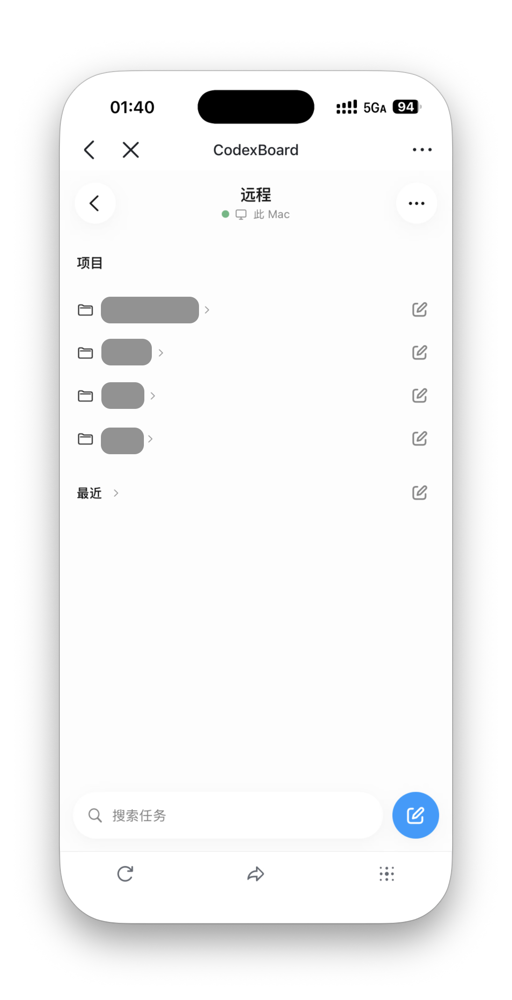

# CodexBoard


[简体中文](README.md) · **English**

Connect your projects to Codex and turn ideas into progress.

**User guide** · [Agent operating guide (Chinese)](AGENTS.md)

CodexBoard connects your project task board to Codex running on your Mac. Organize projects and tasks, submit requests, track execution, and handle approvals or requests for more information. The Mac app starts and manages local services; you access the board through HTTPS with a locally created Web account, through Lark, or both.

Current release: **0.1.3 preview**, for **Apple Silicon Macs running macOS 13 or later**.

## Access methods

|            | Web                                            | Lark                                                 |
| ---------- | ---------------------------------------------- | ---------------------------------------------------- |
| Open in    | Desktop or mobile browser                      | Lark desktop or mobile client                        |
| Identity   | Web account created locally                    | Lark user within the custom app's availability scope |
| Setup      | HTTPS public entry point; no Lark app required | Lark custom app and public tunnel                    |
| CLI writes | Web sign-in does not authorize CLI writes      | Pair with a real Lark user                           |

Both methods can remain enabled and share the same board and local Codex.

## What you can do

- Manage tasks by project using a dashboard, board, or list, with statuses, priorities, labels, comments, and attachments.
- Start or continue Codex execution from a task, and view progress, results, and pending approvals.
- Access the board in a desktop or mobile browser with a local Web account, or use Lark.
- Manage branches and worktrees; desktop connection and port settings adapt to the window size.
- Use mobile Remote to create or continue Codex conversations on your Mac, view streaming results, and handle approvals.
- Send attachments and images from your phone, provide additional input, and view code diffs to review changes.
- Let authorized agents query and manage tasks through the built-in command-line tool.

Local services and task data stay on your Mac. Lark sign-in, public access, and Codex execution still require their respective network services.

## Screenshots

Desktop board, mobile board, and Remote. Click an image to view it at full size.

<p align="center">
  <a href="docs/images/desktop-taskboard.png"></a>
</p>

<table>
  <tr><th>Mobile board</th><th>Remote</th></tr>
  <tr>
    <td align="center"><a href="docs/images/mobile-taskboard.png"></a></td>
    <td align="center"><a href="docs/images/mobile-remote.png"></a></td>
  </tr>
</table>

## Prerequisites

| Requirement                           | Details                                                                                                                        |
| ------------------------------------- | ------------------------------------------------------------------------------------------------------------------------------ |
| Apple Silicon Mac                     | macOS 13 or later. The current installer does not support Intel Macs, Windows, or Linux.                                       |
| Codex                                 | Installed, signed in, and working locally.                                                                                     |
| Lark client and custom app (optional) | Required for Lark access or CLI pairing; not required for Web-only access.                                                     |
| Public frp tunnel service             | A working server or service-provider configuration to access the local services on your Mac.                                   |
| Domain name, depending on tunnel type | HTTP/HTTPS domain-based access requires DNS configuration. TCP access through a public IPv4 address can work without a domain. |

The installer includes **Node.js, the board's frontend and backend, the Codex bridge, SQLite components, Caddy, and the frp client**. You do not need to install Node.js, Docker, Rust, or development tools separately. You must provide Codex and a public frp server. Lark is optional for Web-only access.

## Download and install

1. Open the repository's [Releases page](https://github.com/RocYan98/CodexBoard/releases) and download `CodexBoard-VERSION-macos-arm64.dmg` from the selected release's **Assets**. The `Source code` archives are not installers.
2. If an older version is installed, finish or safely handle any running board tasks, then quit CodexBoard normally from its menu.
3. Open the DMG and drag `CodexBoard.app` into **Applications**.
4. Open CodexBoard from Applications, then eject the installer disk.

To check download integrity, also download the corresponding `.dmg.sha256` file and run the following in the directory containing both files. For version 0.1.3:

```sh
shasum -a 256 -c CodexBoard-0.1.3-macos-arm64.dmg.sha256
```

An `OK` result means the file matches the publisher's checksum.

**The current release has not been signed with an Apple Developer ID or notarized.** macOS may block it on first launch. After confirming that you trust the download source, follow [Apple's instructions](https://support.apple.com/en-mo/102445). You do not need to disable system-wide security checks.

## Initial setup

Open **使用引导 (Setup Guide)** in the app and follow these steps. Chinese labels below match the current app interface.

### 1. Configure the frp client

Obtain a complete `frpc.toml` from your frp provider or your own server setup, and paste it into **连接配置 (Connection Settings)**. The tunnel should forward traffic to `127.0.0.1` on this Mac and the **Caddy 本机端口 (local Caddy port)** shown in the app.

The app detects the public entry address from the tunnel configuration. Use your own configuration; do not copy someone else's authentication parameters or public address.

DNS configuration is part of this step. The guide shows instructions based on the tunnel type: HTTPS and HTTP domain-based access require DNS configuration according to your provider's instructions. TCP access through a public IPv4 address does not require DNS; use the public address directly. Where DNS is needed, use the domain and target shown in the guide.

HTTPS access requires public port 443 to reach the local Caddy service. HTTP and TCP modes use plain HTTP, so sessions and application content are not encrypted with HTTPS.

### 2. Configure Web accounts, Lark, or both

The setup guide can show either Web or Lark instructions. This only changes the guide; Connection Settings supports both methods at once.

#### Web accounts

1. Configure an **HTTPS** public entry point, save it, and start or restart services. Password sign-in is not available over plain HTTP or TCP tunnel entry points.
2. Open **应用设置 → Web 账号 (App Settings → Web Accounts)**, also accessible through **管理 Web 账号 (Manage Web Accounts)** in Connection Settings. Create a username, display name, and password of **8–256 characters**. Accounts can only be created locally; there is no public registration.
3. Open your public URL in a browser and sign in. For Web-only access, leave both Lark App ID and App Secret empty.

The guide checks the running configuration and enabled account availability automatically. It does not test the password or prove a successful browser sign-in; verify that separately.

Web accounts are trusted users who can execute tasks. Accounts share the board without per-project access isolation. New tasks belong to the signed-in user, and comments use that identity. Only create accounts for people you trust. Disabling an account or resetting its password invalidates its existing browser sessions.

CLI writes still require pairing with a real Lark user. Web sign-in does not authorize CLI writes or replace that pairing.

#### Lark app (can remain enabled alongside Web accounts)

Create an enterprise custom web app in the [Lark developer console](https://open.feishu.cn/app). Enter its **App ID** and **App Secret** in **连接配置 (Connection Settings)**.

Use the addresses in the setup guide to configure the desktop and mobile homepages, H5 trusted domains, and redirect URL. Enable the permission to obtain a user's user ID (`contact:user.employee_id:readonly`), then publish an app version in Lark and configure its availability scope.

A successful credentials check only confirms that the credentials work. You still need to verify the publication status, availability scope, and actual sign-in in Lark. Any account that successfully authenticates through Lark can operate the same board, so configure the app's availability scope for your intended users.

### 3. Confirm Codex sign-in, save, and verify

Make sure Codex is installed and signed in on this Mac, then run the checks in the setup guide.

**Running checks does not save your configuration automatically.** Save after filling in the settings. If settings have changed, choose to restart services immediately or restart them manually later. Unchanged settings do not trigger a new restart reminder.

Once **服务概览 (Service Overview)** shows that the backend, Caddy, and public tunnel are healthy, sign in through your Web account or Lark and check that the board loads. When both methods are enabled, verify each separately.

## Everyday use

Manage projects in Codex Desktop, select a synced project on the board, and create a task describing what you need. After starting Codex execution, use the task details to view progress, results, approvals, and requests for more input. Review and accept the result when execution finishes.

- **Close the CodexBoard window:** the app remains in the menu bar and services keep running.
- **Quit CodexBoard or click 停止服务 (Stop Services):** local services stop, and the board becomes temporarily unavailable in both browsers and Lark.
- **Shut down, put your Mac to sleep, or disconnect it from the network:** public access may be interrupted. Keep your Mac online when using remote features.

Quitting CodexBoard does not close Codex Desktop. Handle any executing board tasks before updating or stopping services.

## Install and use the Codex Skill

The companion Skill lets Codex query and modify tasks and assist with execution through the app's built-in command-line tool, without cloning the source or installing Node.js. Installation currently supports Codex; the Skill is named `manage-codexboard`.

On first launch, if the companion Skill is not installed, the app displays **让 Codex 使用 CodexBoard (Let Codex use CodexBoard)**. Choose **安装到 Codex (Install to Codex)**, or install it later from **应用设置 → Agent Skill (App Settings → Agent Skill)**. The installation directory is `~/.agents/skills/manage-codexboard`.

The card shows the file installation status; use **重新检查 (Check Again)** to refresh it. After an app upgrade, it will indicate when a newer Skill is available, and replacement happens only when you click to update. If you have edited the Skill, you must explicitly choose **使用随包版本 (Use Bundled Version)** to replace it. Symbolic links, directories managed by another tool, Skills using the old name, or matching Skills in legacy locations prompt you to handle them at their original location or in their manager, avoiding duplicate installations.

An installed-file status does not mean the Skill is loaded in your current Codex conversation. Check the Skill list in Codex. If it is not recognized, force a Skill reload or reopen Codex when convenient, then use it in a new conversation:

> Please use $manage-codexboard to first list my projects and tasks, then help me handle the task I specify.

Installing the Skill does not grant permission to write to Lark. You still need to complete pairing confirmation in Lark before an agent first acts on your behalf.

## Let an agent help with installation and configuration

To have an agent help install the app, configure it, or troubleshoot a problem, give it this repository's [AGENTS.md (Chinese)](AGENTS.md) and explain what you want to accomplish. For example:

> Please read AGENTS.md, check whether my Mac meets the requirements, and help me install and configure CodexBoard. Clearly tell me when I need to sign in or confirm something in the Lark developer console.

The agent guide covers the built-in `taskctl` entry point, identity pairing, read-only checks, and common operations. It does not require cloning the source or installing development dependencies. Agents differ in how they automatically load instruction files; if yours cannot load the file automatically, provide its contents or a link directly.

## Updates and data

Check for a new version under **应用设置 → 应用更新 (App Settings → App Updates)**, or check manually from the menu bar. The app also checks automatically once a day and displays a notification and release notes when a new version is available. Once the download has been verified, click **安装并重启 (Install and Restart)**, handle running tasks as prompted, and confirm installation. Services keep running during checks and downloads; installation briefly stops the local services.

Update packages are verified with a separate signing key. If automatic updating is unavailable, quit the old version normally and replace `CodexBoard.app` in Applications using the new DMG. Configuration, the database, and attachments are stored in:

```text
~/Library/Application Support/CodexBoard/
```

On the first launch after upgrading, if the new directory does not exist, the app automatically migrates the existing data after the old version has exited. If directories conflict, it preserves the existing data and prompts you to resolve the conflict. Replacing the app normally preserves your data. Deleting the data directory affects configuration and tasks; do not treat it as an installer cache or share it with other people alongside the installer.

## Troubleshooting

| Symptom                                                | What to check first                                                                                                                                                     |
| ------------------------------------------------------ | ----------------------------------------------------------------------------------------------------------------------------------------------------------------------- |
| macOS cannot verify the developer                      | The current release is not notarized. Verify the download source and follow the Apple instructions above.                                                               |
| A port is in use and services cannot start             | Choose available ports in 端口设置 (Port Settings), save, and restart. Do not arbitrarily terminate other programs.                                                     |
| Local services work, but the app does not open in Lark | Check that the Mac is online, along with the frp service, DNS, Lark homepage settings, publication status, and availability scope.                                      |
| The Lark credentials check passes, but sign-in fails   | Check the user ID permission, trusted domains, and redirect URL, then try signing in through Lark.                                                                      |
| Codex checks fail or projects do not appear            | Confirm sign-in and projects in Codex, then check again in the app. A basic sign-in check does not guarantee that online requests will work or that quota is available. |

When reporting an issue, include the app version, macOS version, steps to reproduce it, and screenshots with sensitive details removed. Do not publish your App Secret, tunnel credentials, login tokens, or complete data directory.

## Source code and technical references

Developers can consult the [development and operations reference](docs/development.md), [desktop app documentation](apps/desktop/README.md), and [taskctl command reference](docs/taskctl.md). These documents are in Chinese and are intended for development and troubleshooting; a normal installation does not require running their build commands.
