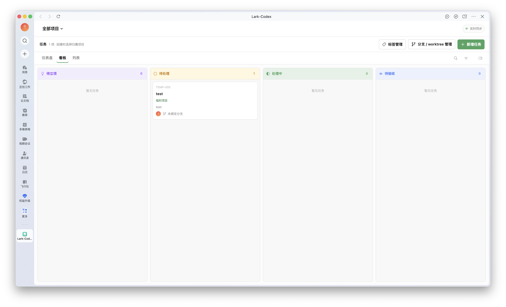
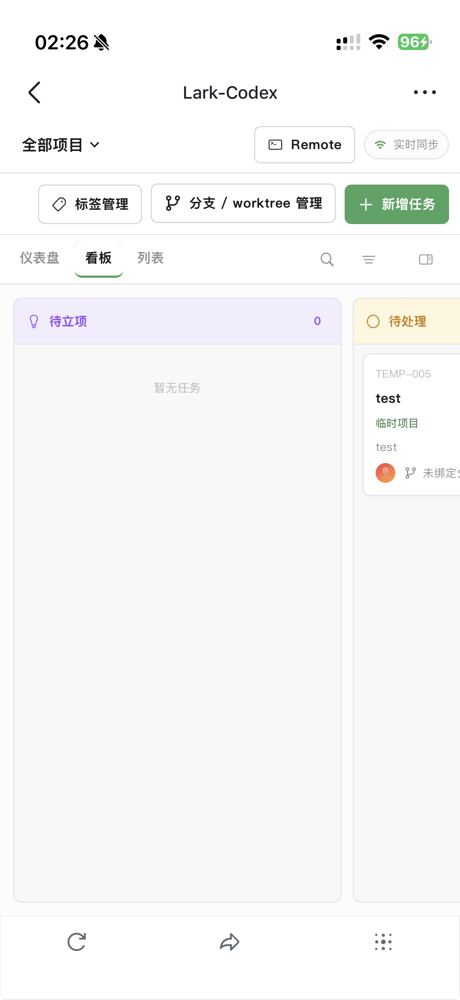
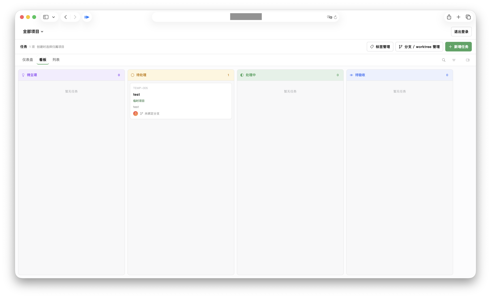
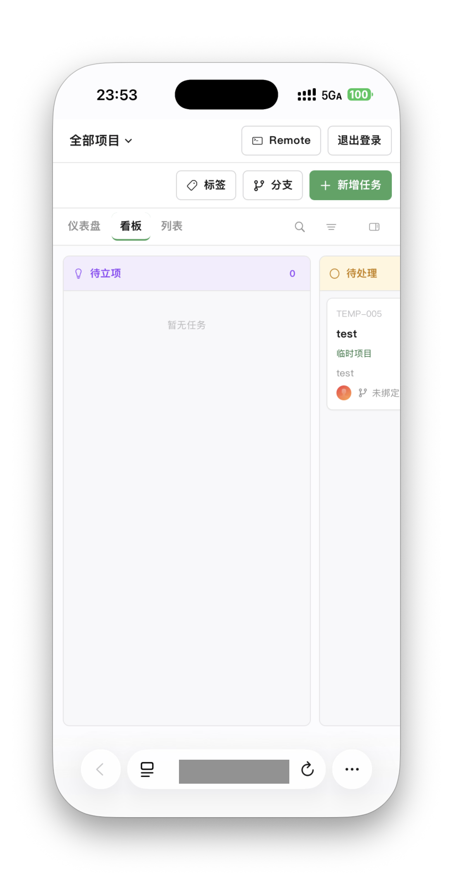

# DevBoard


[简体中文](README.md) · **English**

Project control plane for managing projects, milestones, tasks, and remote runs.

**User guide** · [Agent operating guide (Chinese)](AGENTS.md)

DevBoard is a Docker-hosted control plane. The container provides the Web UI, API, SQLite, Lark, Runs, and approvals. Codex, Cursor, Grok Build, and OpenCode execute over SSH on selected Connection Hosts. Production Git/worktree management and task Git finalization currently fail closed and are not yet connected to remote Workspace Mappings. Browser and Lark use the same board and Run state.

Docker Compose is the primary deployment. The target image is `ghcr.io/404404/devboard` for `linux/amd64` and `linux/arm64`.

## Access methods

|          | Web                                                 | Lark                                                 |
| -------- | --------------------------------------------------- | ---------------------------------------------------- |
| Open in  | Desktop or mobile browser                           | Lark desktop or mobile client                        |
| Identity | Web account                                         | Lark user within the custom app's availability scope |
| Setup    | External HTTPS reverse proxy                       | Lark custom app and external HTTPS                   |

Both methods can remain enabled and share the same control plane, projects, and Runs.

## What you can do

- Manage tasks by project using a dashboard, board, or list, with statuses, priorities, labels, comments, and attachments.
- Start or continue Codex execution from a task, and view progress, results, and pending approvals.
- Access the board in a desktop or mobile browser with a local Web account, or use Lark.
- Configure SSH Hosts, Providers, Execution Profiles, and remote Workspace Mappings.
- View the same streamed Run events and approvals from Web or Lark.
- Send attachments and images from your phone and provide additional input to the same Run.
- Manage tasks and remote Runs through Web or Lark; the container does not provide legacy local-cwd taskctl semantics.

The container does not install coding CLIs or mount host project directories or `~/.codex`. Workspace paths resolve through `Project → WorkspaceMapping → SSH Host`.

## Screenshots

### Lark · Desktop and mobile

Manage tasks in the Lark custom app. Web and Lark share the same projects, runs, events, and approvals.

<table>
  <tr><th>Desktop board</th><th>Mobile board</th></tr>
  <tr>
    <td align="center"><a href="docs/images/desktop-taskboard.png"></a></td>
    <td align="center"><a href="docs/images/mobile-taskboard.png"></a></td>
  </tr>
</table>

### Web · Desktop and mobile browsers

Sign in over HTTPS with a locally created Web account. Click a thumbnail to view the full image.

<table>
  <tr><th>Desktop browser</th><th>Mobile browser</th></tr>
  <tr>
    <td align="center"><a href="docs/images/web-desktop-redacted.png"></a></td>
    <td align="center"><a href="docs/images/web-mobile-redacted.png"></a></td>
  </tr>
</table>

## Docker deployment

You need Docker Engine, Docker Compose, and an external HTTPS reverse proxy. Each execution node—including the Docker Host itself—needs an SSH server, Git, and the selected Provider CLI. These programs are not installed in the DevBoard container.

```sh
cp .env.example .env
mkdir -p secrets/ssh
chmod 700 secrets secrets/ssh
# Edit .env: set DEVBOARD_PUBLIC_ORIGIN and the observed proxy IP/CIDR in DEVBOARD_TRUST_PROXY
docker compose config
docker compose up -d
docker compose ps
```

Compose publishes `127.0.0.1:47823` by default for a reverse proxy on the same host. For a LAN-hosted proxy, set `DEVBOARD_BIND_ADDRESS` and restrict access with a firewall. TLS terminates at the external proxy. Production requires an explicit HTTPS `DEVBOARD_PUBLIC_ORIGIN`; `DEVBOARD_TRUST_PROXY` must list only the actual proxy address or CIDR.

Initial setup: start Compose → configure HTTPS reverse proxy and Public Origin → configure the Lark app (optional) → create an SSH Host and manually verify its Host Key fingerprint → detect remote Providers → create an Execution Profile → create/map the project's remote Workspace. For Docker Desktop, `host.docker.internal` is a convenient Host name. Linux Docker Engine can use Compose's `host-gateway` mapping where supported, or a LAN IP/DNS name.

SQLite, attachments, backups, runtime state, and trusted `known_hosts` persist in `/var/lib/devboard`. Replacing the image does not replace this volume. The former macOS Desktop app is deprecated and is not a primary release target.

## Everyday use

Create Projects and Tasks in DevBoard, map each Project to an absolute Workspace path on its SSH Host, then start a Run with an Execution Profile. Run state, events, approvals, and Continue are shared by Web and Lark. Changing the Provider Host does not change the Project or Task.

## Container operations

Backup and verification commands can run inside the container via `docker exec`. The Admin API remains loopback-only and is not published to the host:

```sh
docker compose exec -T devboard node apps/server/dist/ops.js backup
docker compose exec -T devboard node apps/server/dist/ops.js verify /var/lib/devboard/backups/<backup-id>
# Password is read without echo from the TTY; it is not placed in argv, env, or output
docker compose exec -it devboard node apps/server/dist/ops.js web-account create --username alice --name "Alice"
docker compose exec -T devboard node apps/server/dist/ops.js web-account list
```

The old `manage-codexboard` Skill/taskctl depends on the macOS Desktop runtime, caller cwd, and legacy Job/Git model. It is deprecated and does not operate SSH Runs. Read the [operations guide](docs/development.md) before backup or restore operations.

## Let an agent help with installation and configuration

To have an agent help deploy DevBoard, give it this repository's [AGENTS.md (Chinese)](AGENTS.md) and explain what you want to accomplish. For example:

> Please read AGENTS.md and help deploy DevBoard with Docker Compose, an external HTTPS reverse proxy, and an SSH Host. Tell me when I need to verify a Host Key or confirm settings in the Lark developer console.

See the [deployment guide](docs/reverse-proxy.md) for proxy and SSH key setup. Never put a private key, App Secret, Web password, or runtime capability in chat, command arguments, or issues.

## Updates and data

Update the container image and recreate the service while preserving the `devboard-data` volume. Take a DevBoard backup before an upgrade. Keep `.env` and `secrets/ssh` outside the image; never replace or delete the data volume as part of an image update. The macOS Desktop runtime is deprecated and is not part of the primary release workflow.

## Troubleshooting

| Symptom | What to check first |
| --- | --- |
| Container is unhealthy | Check `docker compose logs devboard`, `/api/health`, and write access to the data volume. An offline SSH Host does not make the control plane unhealthy. |
| Login redirects loop or Secure cookie is missing | Check that Public Origin is the external HTTPS URL and `DEVBOARD_TRUST_PROXY` contains only the reverse proxy's actual source address/CIDR. |
| Lark callback or H5 page fails | Check Public Origin, the HTTPS proxy route, Lark redirect/allowed domains, app publication, and availability scope. |
| SSE stops behind the proxy | Disable buffering for `/api/v1/events/stream` and increase the proxy read timeout; see [reverse-proxy.md](docs/reverse-proxy.md). |
| SSH connection fails | Check TCP/22, the confirmed Host Key fingerprint, selected key/agent, remote username, and Provider installation on that Host. |

When reporting an issue, include the image tag/digest, container logs with secrets removed, and steps to reproduce it. Never publish an App Secret, private key, login token, or complete data volume.

## Source code and technical references

Developers can consult the [architecture overview](docs/architecture.md), [execution platform](docs/execution-platform.md), [Provider guide](docs/providers.md), [Docker/reverse-proxy deployment](docs/reverse-proxy.md), and the [development and operations reference](docs/development.md). Desktop/taskctl sources are retained only as migration history.
