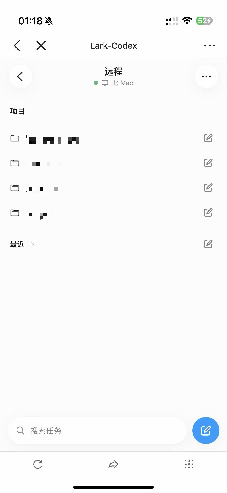

# Lark-Codex

在飞书里管理任务，让 Mac 上的 Codex 参与执行。

**用户指南** · [给 Agent 的操作指南](AGENTS.md)

Lark-Codex 将飞书任务看板与本机 Codex 连接起来。你可以整理项目和任务、提交需求、查看执行进度，并在需要时处理审批或补充信息。Mac 应用负责启动和管理本机服务，看板在飞书中使用。

当前为 **0.1.1 预览版**，支持 **Apple Silicon Mac · macOS 13 或更新版本**。

## 可以做什么

- 按项目管理任务，通过仪表盘、看板和列表查看工作，维护状态、优先级、标签、评论和附件。
- 从任务中发起或继续 Codex 执行，查看进度、执行结果和需要你处理的审批。
- 在飞书桌面端或移动端访问看板，连接运行在自己 Mac 上的工作环境。
- 通过移动端 Remote 创建或继续 Mac 上的 Codex 对话，实时查看流式结果并处理审批。
- 从手机发送附件和图片、补充执行所需信息，查看代码 diff 并审查改动。
- 通过内置命令行工具，让已授权的 Agent 查询和管理任务。

本机服务与任务数据保存在你的 Mac 上；飞书登录、公网访问和 Codex 执行仍需要对应的网络服务。

## 界面预览

### 桌面端任务看板

在飞书桌面端按状态查看和管理任务。


### 移动端 Remote

Remote 让你在飞书移动端连接 Mac 上的 Codex，参考 Codex Desktop 的主要交互体验。手机和 Mac 都在国内时，搭配国内 frp 服务器，远程访问可走国内链路、减少跨境中转，有助于交互流畅；模型请求仍由本机 Codex 连接其服务。

- 按项目查看会话，创建新对话或继续已有对话。
- 实时查看流式结果，处理审批和补充输入。
- 发送附件和图片，查看代码 diff 并审查改动。



## 安装前准备

| 需要准备               | 说明                                                               |
| ---------------------- | ------------------------------------------------------------------ |
| Apple Silicon Mac      | macOS 13+；当前安装包不支持 Intel Mac、Windows 或 Linux            |
| Codex                  | 已安装并登录，在本机可以正常使用                                   |
| 飞书客户端与自建应用   | 需要能够创建、配置和发布飞书企业自建网页应用                       |
| 公网 frp 隧道服务      | 准备可用的服务端或服务商配置，用于访问 Mac 上的本地服务            |
| 域名（按隧道类型需要） | HTTP/HTTPS 域名入口需要 DNS 配置；TCP 公网 IPv4 模式可以不使用域名 |

安装包已包含 **Node.js、看板前后端、Codex 桥接、SQLite 组件、Caddy 和 frp 客户端**。无需另装 Node.js、Docker、Rust 或开发工具。Codex、飞书客户端和公网 frp 服务端需要自行准备。

## 下载与安装

1. 打开本仓库的 [Releases 页面](https://github.com/RocYan98/Lark-Codex/releases)，在所选版本的 **Assets** 中下载 `Lark-Codex-版本号-macos-arm64.dmg`。`Source code` 压缩包不是安装包。
2. 如果已安装旧版，先结束或妥善处理正在执行的看板任务，再从菜单栏正常退出 Lark-Codex。
3. 打开 DMG，将 `Lark-Codex.app` 拖入 **Applications（应用程序）**。
4. 从“应用程序”打开 Lark-Codex，随后推出安装磁盘。

如需校验下载完整性，同时下载对应的 `.dmg.sha256` 文件，在两个文件所在目录执行。以 0.1.1 为例：

```sh
shasum -a 256 -c Lark-Codex-0.1.1-macos-arm64.dmg.sha256
```

显示 `OK` 表示文件与发布者提供的校验值一致。

**当前版本尚未完成 Apple Developer ID 签名和公证。** 首次打开可能被 macOS 拦截。确认下载来源可信后，按 [Apple 官方说明](https://support.apple.com/en-mo/102445)处理；不需要关闭系统的整体安全检查。

## 首次配置

打开应用中的 **使用引导**，按页面完成以下步骤。

### 1. 配置 frp 客户端

从你的 frp 服务商或自建服务端获取完整的 `frpc.toml`，在“连接配置”中粘贴。隧道应转发到这台 Mac 的 `127.0.0.1` 和应用显示的 **Caddy 本机端口**。

应用会从隧道配置自动识别公网入口。请使用自己的隧道配置，不要直接复制他人的认证参数或公网地址。

DNS 解析已包含在这一步中，应用会根据隧道配置显示对应说明：HTTPS（以及 HTTP）域名入口需要按服务商要求配置 DNS；TCP 公网 IPv4 入口无需 DNS，直接使用公网地址。需要解析时，参考这一步显示的域名和解析目标。

HTTPS 入口需要公网 443 能到达本机 Caddy。HTTP 和 TCP 模式使用明文 HTTP，会话和业务内容不经过 HTTPS 加密。

### 2. 创建并配置飞书应用

在 [飞书开发者后台](https://open.feishu.cn/app)创建企业自建网页应用，将 **App ID** 和 **App Secret** 填入“连接配置”。

按使用引导中的地址设置桌面与移动主页、H5 可信域名和重定向 URL，并开通“获取用户 user ID”权限（`contact:user.employee_id:readonly`）。随后在飞书后台发布版本并设置可用范围。

飞书应用凭据检查通过，只表示凭据可用；发布状态、可用范围和实际登录仍需要在飞书中确认。任何通过飞书登录验证的账号均可操作同一看板，请按实际需要设置应用可用范围。

### 3. 确认 Codex 登录，保存并验证

确认 Codex 已在这台 Mac 上安装并登录，再运行引导中的检查。

**检查不会自动保存配置。** 完成填写后保存配置；实际发生修改时，选择立即重启服务或稍后手动重启。未修改内容时不会新增重启提醒。

当“服务概览”显示后端、Caddy 和公网隧道正常后，从飞书打开你配置的应用，完成登录并查看看板。首次配置才算完成。

## 日常使用

在 Codex Desktop 中管理项目，在看板选择同步出的项目，创建任务并描述需求。发起 Codex 执行后，可以在任务详情查看进度、结果、审批和待补充输入；执行结束后再检查结果并验收。

- **关闭 Lark-Codex 窗口**：应用保留在菜单栏，服务继续运行。
- **退出 Lark-Codex 或点击停止服务**：本机服务停止，飞书中的看板暂时无法访问。
- **Mac 关机、休眠或断网**：公网访问可能中断；使用远程功能时需要保持 Mac 在线。

退出 Lark-Codex 不会关闭 Codex Desktop，但应在更新或停止服务前处理好看板中的执行任务。

## 让 Agent 帮你配置或操作

首次启动且尚未安装配套技能时，应用会显示 **让 Codex 使用 Lark-Codex** 提示，可以选择 **安装到 Codex**，也可以稍后从 **应用设置 → Agent Skill** 安装。应用会把随包的 `manage-lark-codex` 技能安装到 `~/.agents/skills/manage-lark-codex`，用于通过内置命令行查询、修改任务和协助执行，无需克隆源码或安装 Node.js。

卡片会显示文件安装状态，可用“重新检查”刷新。应用升级后会提示有新版技能，点击更新后才替换；已有用户修改时，须明确选择“使用随包版本”。符号链接、由其他工具管理的目录、旧版名称的技能或旧技能目录中的同名技能，会提示回到原位置或管理器处理，避免重复安装。

“文件已安装”不表示当前 Codex 任务已加载技能。请在 Codex 的技能列表中确认；未识别时可强制重新加载技能，或在方便时重新打开 Codex，再在新任务中使用：

> 请使用 $manage-lark-codex，先查看我的项目和任务，再帮我处理指定任务。

技能安装不等于飞书写入授权。Agent 首次代操作时仍需你在飞书中完成配对确认。

把本仓库的 [AGENTS.md](AGENTS.md)交给 Agent，并说明你要完成的事情，例如：

> 请阅读 AGENTS.md，检查我的 Mac 是否满足要求，帮我安装并配置 Lark-Codex。需要我登录或在飞书后台确认的步骤，请明确告诉我。

Agent 指南提供内置 `taskctl` 的入口、身份配对、只读检查和常用操作流程，无需为此克隆源码或安装开发依赖。不同 Agent 对指令文件的自动读取方式不同；不能自动读取时，直接提供文件内容或链接。

## 更新与数据

在 **应用设置 → 应用更新** 中检查新版本，也可以从菜单栏手动检查。应用每天自动检查一次，发现新版本后显示提醒和更新说明。下载并验证完成后，点击“安装并重启”，按提示处理正在执行的任务，再确认安装。检查和下载期间服务继续运行；安装时本机服务会暂时停止。

更新包使用独立签名校验。无法自动更新时，可正常退出旧版，再用新版 DMG 替换“应用程序”中的 `Lark-Codex.app`。配置、数据库和附件保存在：

```text
~/Library/Application Support/Lark-Codex/
```

升级首次启动时，若新目录尚不存在，应用会在旧版退出后自动迁移已有数据；遇到目录冲突时会保留原数据并提示处理。正常替换应用会保留数据。删除数据目录会影响配置和任务数据，不要把它当成安装缓存清理，也不要随安装包发送给别人。

## 常见问题

| 现象                         | 先检查什么                                                                        |
| ---------------------------- | --------------------------------------------------------------------------------- |
| macOS 提示无法验证开发者     | 当前版本未公证；核对来源并查看上面的 Apple 官方说明                               |
| 端口被占用，服务无法启动     | 在“端口设置”中选用空闲端口；修改后保存并重启，不要随意结束其他程序                |
| 本机服务正常，飞书里打不开   | 检查 Mac 是否在线、frp 服务与 DNS，以及飞书主页、发布状态和可用范围               |
| 飞书凭据检查通过，但登录失败 | 检查 user ID 权限、可信域名和重定向 URL，再从飞书实际登录                         |
| Codex 检查未通过或项目未出现 | 先在 Codex 中确认登录与项目，再回到应用检查；基础登录检查不保证在线请求和额度可用 |

反馈问题时，请提供应用版本、macOS 版本、复现步骤和经过脱敏的报错截图。不要公开 App Secret、隧道认证信息、登录令牌或完整数据目录。

## 源码与技术资料

开发者可查阅 [开发与运维参考](docs/development.md)、[桌面应用说明](apps/desktop/README.md)和 [taskctl 命令参考](docs/taskctl.md)。这些资料供开发与排障使用，普通安装不需要执行其中的构建命令。
